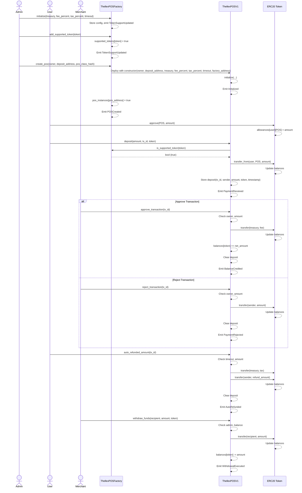

scarb build

sncast account import \
 --address=0x064b48806902a367c8598f4f95c305e8c1a1acba5f082d294a43793113115691 \
 --type=oz \
 --url=http://127.0.0.1:5050 \
 --private-key=0x0000000000000000000000000000000071d7bb07b9a64f6f78ac4c816aff4da9 \
 --add-profile=devnet \
 --silent

sncast --profile=devnet deploy \
 --class-hash=0x72d11036798a397d1ac15d4767189b704a7d4af5b89065d4bba79ec965e0063 \
 --salt=0

sncast --profile=devnet invoke \
 --contract-address=0x0680845dd2b6022f9a7d16b880d63a393d6c90717d62a3f5defb9fbed9f0aceb \
 --function=initialize \
--arguments 0x0680845dd2b6022f9a7d16b880d63a393d6c90717d62a3f5defb9fbed9f0aceb 100 200 3600

sncast --profile=devnet call \
 --contract-address 0x0680845dd2b6022f9a7d16b880d63a393d6c90717d62a3f5defb9fbed9f0aceb \
 --function **starknet**entry_points

# ThellexPOS System

## Overview

The `ThellexPOSFactory` and `ThellexPOSV1` contracts form a Point of Sale (POS) system on Starknet for managing token deposits, transaction approvals, and withdrawals.

## Interaction Flow

Below is a sequence diagram illustrating how `ThellexPOSFactory` and `ThellexPOSV1` interact with users, merchants, and ERC20 tokens.

